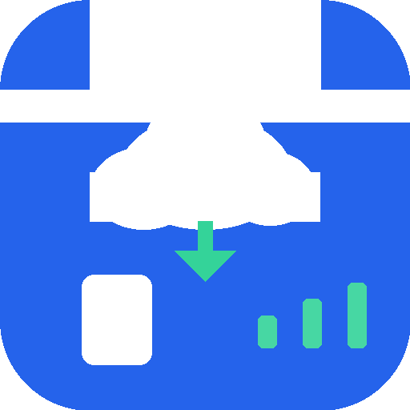
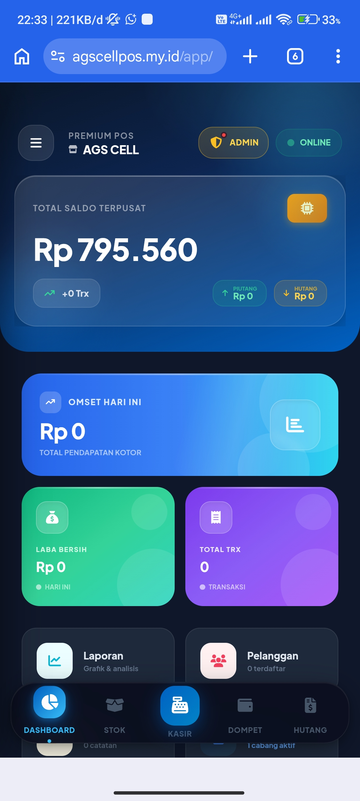
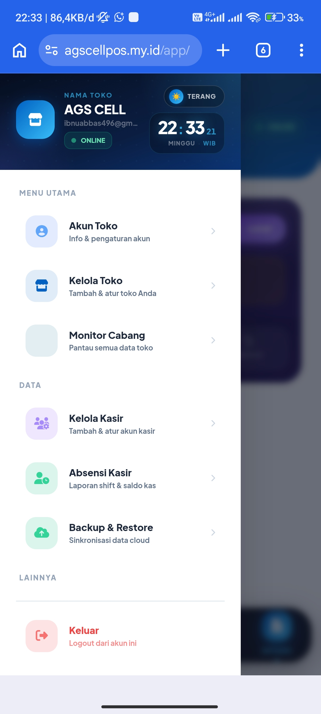
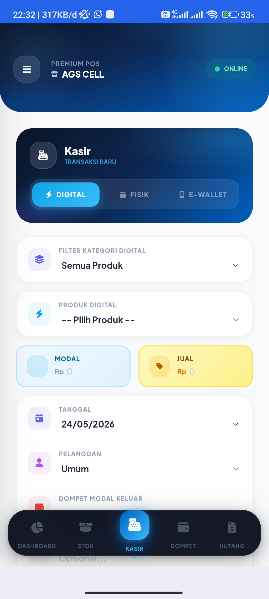
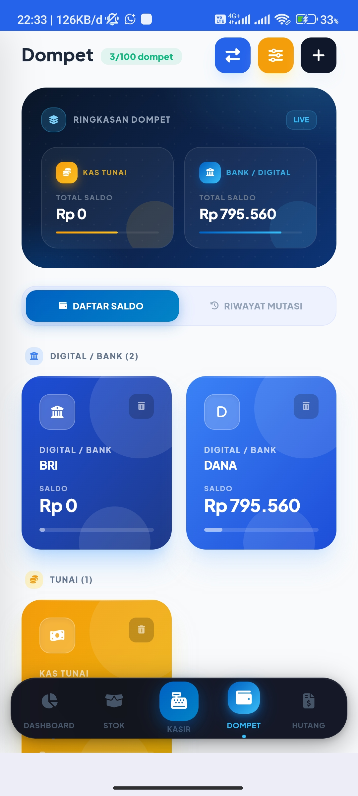
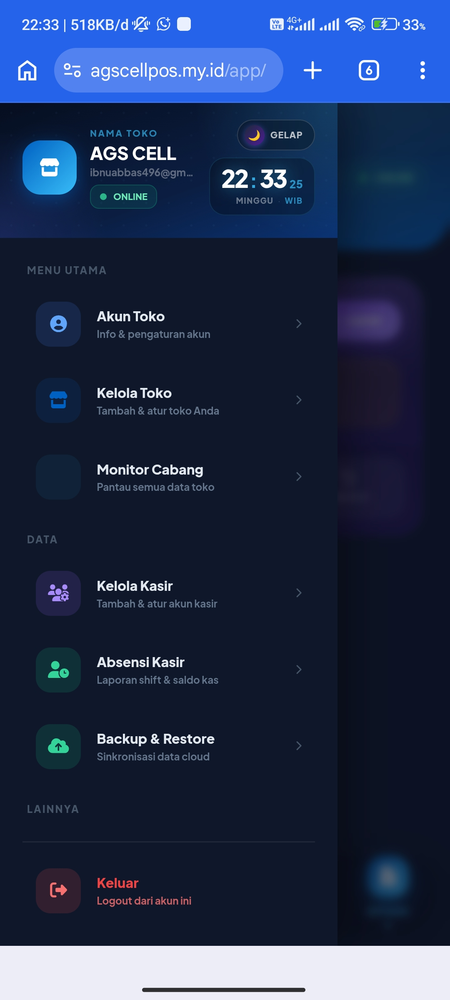
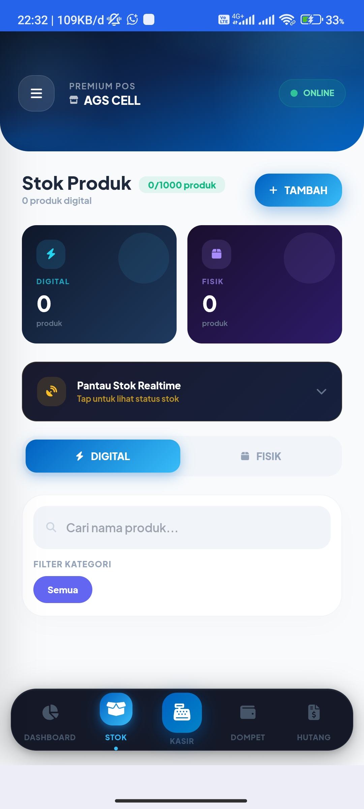
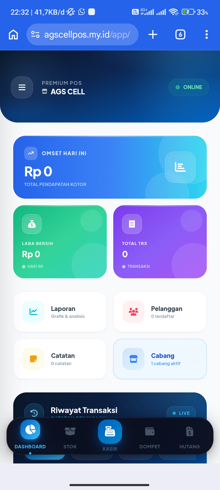

<div align="center">

KonterKu Cloud
Aplikasi POS & Manajemen Bisnis Konter Pulsa berbasis Cloud


🚀 Buka Aplikasi · 📖 Dokumentasi · 🐛 Laporkan Bug
</div>
---
📱 Tentang KonterKu Cloud
KonterKu Cloud adalah aplikasi manajemen bisnis konter pulsa, paket data, dan aksesoris HP yang berjalan langsung di browser — tanpa install, tanpa server sendiri. Data tersimpan real-time di Firebase Firestore dan bisa diakses dari HP, tablet, maupun laptop kapan saja.
Cocok untuk pemilik konter yang ingin mengelola transaksi harian, stok produk, keuangan, dan kasir secara terpusat — bahkan untuk lebih dari satu toko sekaligus.
---
✨ Fitur Utama
🏪 Multi-Toko
Kelola lebih dari satu toko dalam satu akun
Setiap toko memiliki data kasir, produk, dan transaksi yang terpisah
Monitor semua cabang dari satu dashboard
💰 Kasir & Transaksi
Kasir Digital & E-Wallet (DANA, GoPay, OVO, dll)
Kasir Fisik — penjualan HP & aksesoris
Scan barcode produk langsung dari kamera HP
Cetak struk digital dengan logo & tagline toko
📦 Kelola Produk & Stok
Manajemen stok real-time
Notifikasi stok menipis otomatis
Kategori produk fleksibel
👥 Manajemen Kasir
Tambah kasir dengan role berbeda (Digital / Fisik / Lihat Stok)
Sistem absensi kasir dengan laporan shift
Saldo kas awal & akhir per shift
📊 Laporan & Analitik
Dashboard statistik penjualan harian / bulanan
Grafik pendapatan interaktif (Chart.js)
Export laporan ke PDF
Laporan per kasir, per toko, per periode
💼 Dompet & Keuangan
Pencatatan modal & pengeluaran
Histori saldo kas per shift
Rekap keuangan otomatis
☁️ Cloud & Backup
Data tersimpan otomatis di Firebase Firestore
Backup & restore data kapan saja
Akses dari perangkat mana pun tanpa sinkronisasi manual
---
🛠️ Teknologi
Teknologi	Kegunaan
Firebase Firestore	Database real-time cloud
Firebase Auth	Login & autentikasi pengguna
Tailwind CSS	UI framework
Chart.js	Grafik & visualisasi data
ZXing	Scanner barcode via kamera
SweetAlert2	Dialog & notifikasi
Font Awesome	Ikon UI
PWA	Install ke homescreen / buat APK
---
📁 Struktur Repo
```
KonterKu/
├── app/
│   └── index.html        # Aplikasi utama (dashboard POS)
├── index.html            # Landing page
├── favicon.ico           # Favicon browser
├── icon-192.png          # Icon PWA Android
├── icon-512.png          # Icon HD / Play Store
├── apple-touch-icon.png  # Icon iOS homescreen
├── manifest.json         # PWA manifest
└── CNAME                 # Custom domain GitHub Pages
```
---
🚀 Cara Pakai
Login sebagai Pemilik Toko
Buka aplikasi
Tap Daftar → isi nama toko, email, password
Login → langsung masuk ke dashboard
Login sebagai Kasir
Tap tab Kasir di halaman login
Masukkan Kode Toko (dari pemilik) dan password kasir
Mulai catat transaksi
Install ke Homescreen Android
Buka aplikasi di Chrome
Tap menu ⋮ → Tambahkan ke layar utama
Aplikasi siap dipakai seperti APK native ✅
---
👤 Role Pengguna
Role	Akses
Pemilik (Owner)	Full akses — kelola toko, kasir, laporan, produk, keuangan
Kasir Digital	Input transaksi digital & e-wallet
Kasir Fisik	Input penjualan HP & aksesoris
Kasir (Lihat Stok)	Hanya bisa melihat daftar stok produk
---
📸 Screenshot
<div align="center">
<table>
  <tr>
    <td align="center"><b>Dashboard (Owner)</b></td>
    <td align="center"><b>Dashboard (Admin)</b></td>
    <td align="center"><b>Stok Produk</b></td>
    <td align="center"><b>Kasir</b></td>
  </tr>
  <tr>
    <td></td>
    <td></td>
    <td></td>
    <td></td>
  </tr>
  <tr>
    <td align="center"><b>Dompet</b></td>
    <td align="center"><b>Hutang & Piutang</b></td>
    <td align="center"><b>Menu (Dark)</b></td>
    <td align="center"><b>Menu (Light)</b></td>
  </tr>
  <tr>
    <td></td>
    <td></td>
    <td></td>
    <td></td>
  </tr>
</table>
</div>
---
🤝 Kontribusi
Pull request dan saran fitur sangat diterima! Silakan buka issue baru untuk melaporkan bug atau mengusulkan fitur.
---
📄 Lisensi
Proyek ini menggunakan lisensi MIT.
---
<div align="center">
Dibuat dengan ❤️ untuk pelaku UMKM Indonesia
⬆ Kembali ke atas
</div>
